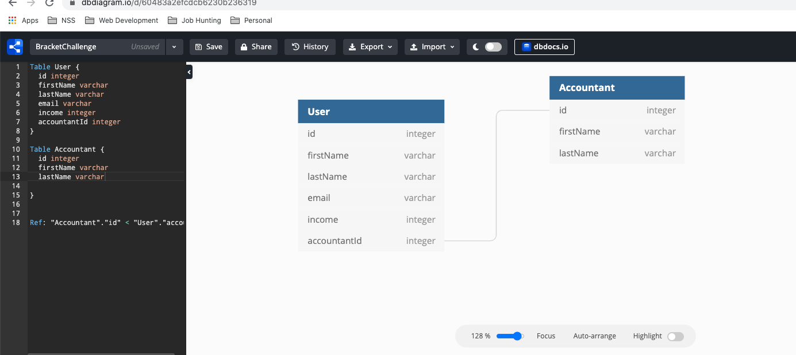

# Tax-Bracket-Challenge

Progressive tax bracket challenge questions for Roostify dev positions

Roostify Take home assignment

# Question - Bracketed Tax Engine:

Write a program that calculates income tax based on the following rules:

- The portion of the income that is less than $10k is untaxed
- The portion of the income that is less than $20k is taxed at 10%
- The portion of the income that is less than $50k is taxed at 20%
- Any portion of the income that is above $50k is taxed at 30%

**1. Assume this application will be used by a 3rd party tax consultant who will have to run this for 100 clients.  
 Write a program that is scalable.
The program should take the $ income and return the tax amount.**

For this challenge, I created variables for each tax bracket and variables to calculate tax on up to 20K and 50K.
I then defined a function that takes income as an argument and set an intial tax amount of zero. I then created conditionals that return the tax amount based on the income given as an argument. I passed income amounts through print statements to check the program.

I believe this program is scalable because the only thing that would need to change based on the information given is the income amount for each client.

I found this challenge fun and frustrating. I wrestled with it (in the best way). I started by trying to wrap my head around it by writing out some of the math concepts on scratch pieces of paper and thinking through/creating a rough draft ERD.

**2. Imagine there are actually 50+ brackets that change every year, and we need to compute 1 Billion income tax projections every year.  
Describe in a few bullet points how you’d build a solution that scales.**

Scalability is something that I have more questions about than I have answers for. I have been trying to do research to grasp a better understanding of what it would look like in a situation like this. I think I would try to:

- Build a program that needs only minimal changes, such as the tax brackets themselves
- Adhere to single responsiblity principle
-
